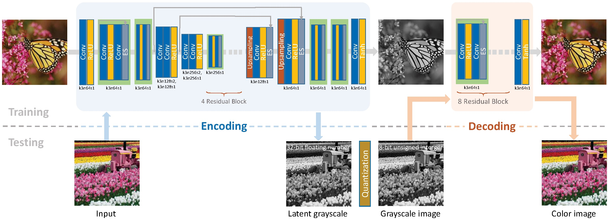
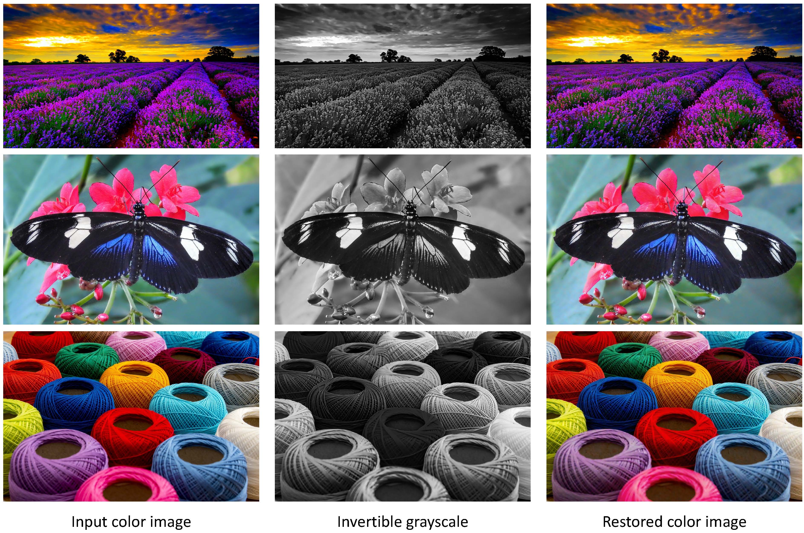

## Invertible Grayscale

We run this code under [TensorFlow](https://www.tensorflow.org) 1.6 on Ubuntu16.04 with python pakage IPL installed.

### Network Architecture

TensorFlow Implementation of our paper ["Invertible Grayscale"](http://menghanxia.github.io/papers/2018_Invertible_Grayscale_siga.pdf) accepted to SIGGRAPH ASIA 2018.

<div align="center">
	
</div>

### Results

<div align="center">
	
</div>

### Preparation

- You can use any color image set as the training data of the network, as it is a self-supervised learning scheme. 
- The patch size is set to 256x256 in the [`model.py`](model.py) (you may change it to any other size as you like).
- Download the pretrained VGG19 model in [here](https://mega.nz/#!xZ8glS6J!MAnE91ND_WyfZ_8mvkuSa2YcA7q-1ehfSm-Q1fxOvvs).

### Run
- Set your image folders and hyperparameters in [`main.py`](./main.py).

- Start training.
```bash
python3 main.py --mode 'train'
```

- Start evaluation. (access [pretrained model](https://drive.google.com/open?id=1wUKSzoYijU0dfyp9cl-9gTqyJY20OU2Y ))
```bash
python3 main.py --mode 'test'
```

### Copyright and License
You are granted with the [license](./LICENSE.txt) for both academic and commercial usages.

### Citation
If any part of our paper and code is helpful to your work, please generously cite with:
```
@article{XiaLW18,
  author    = {Menghan Xia and Xueting Liu and Tien-Tsin Wong},
  title     = {Invertible grayscale},
  journal   = {{ACM} Trans. Graph.},
  volume    = {37},
  number    = {6},
  pages     = {246:1--246:10},
  year      = {2018}
}
```
